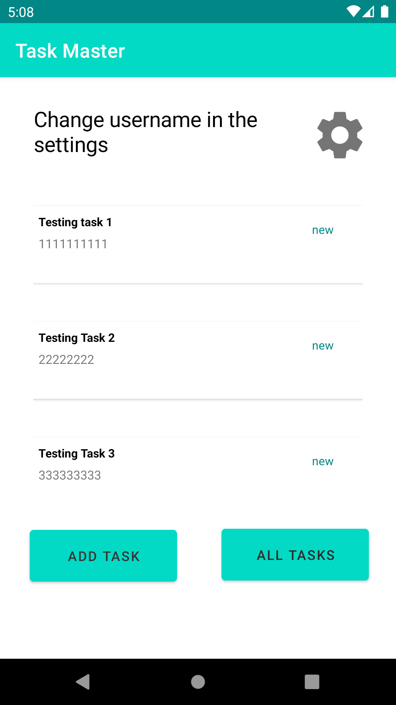
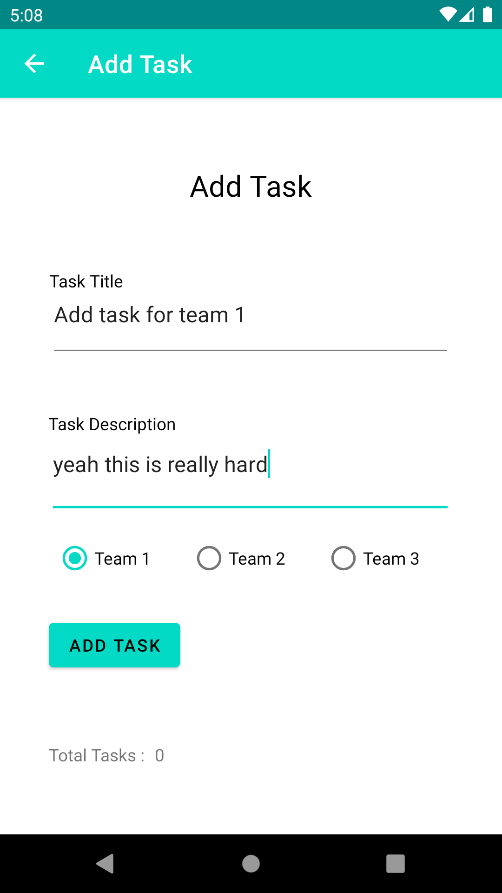
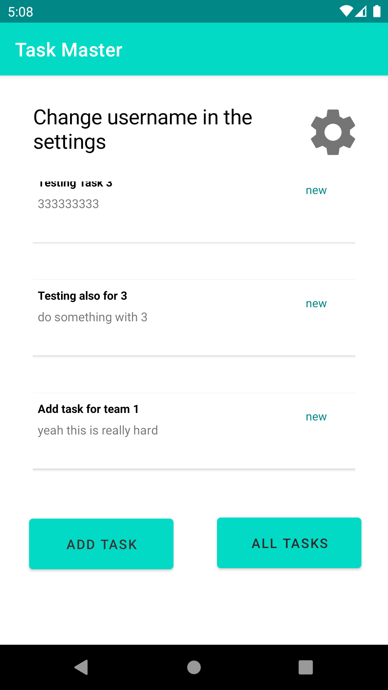
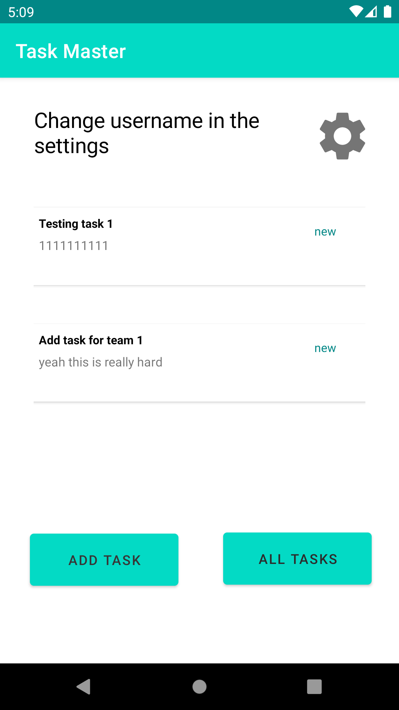
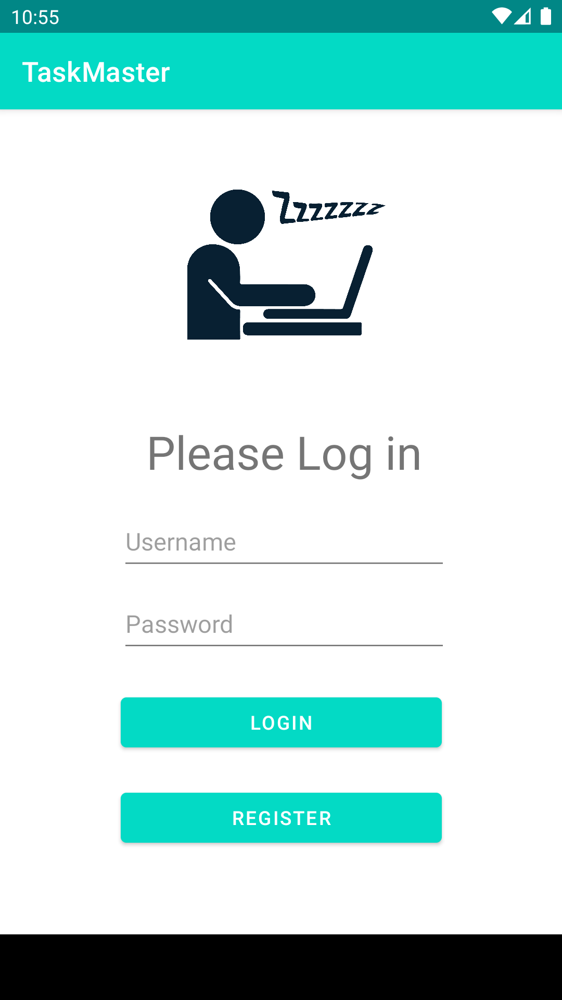
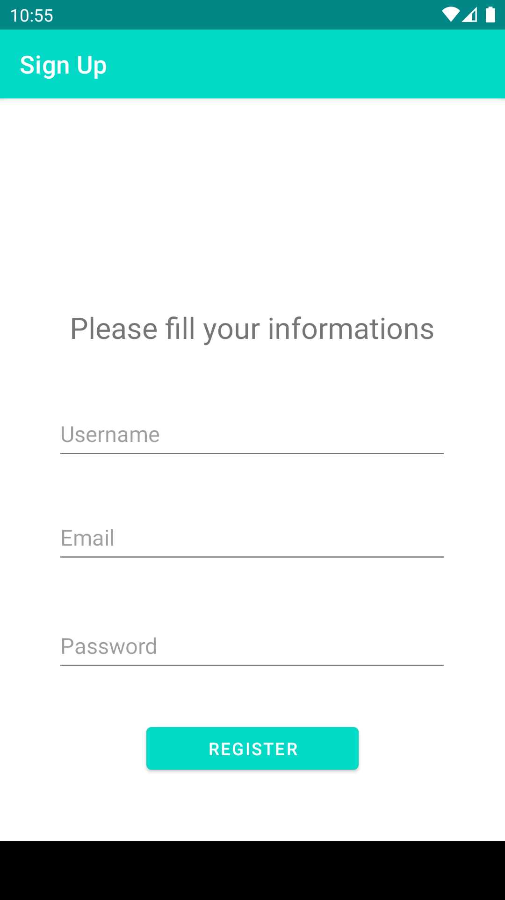
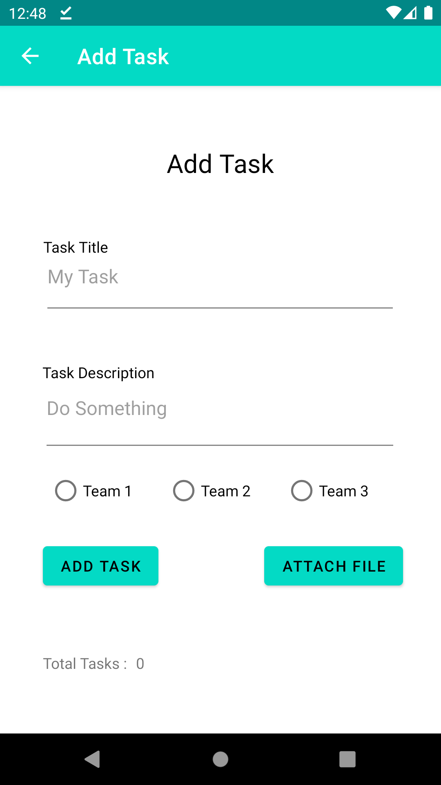
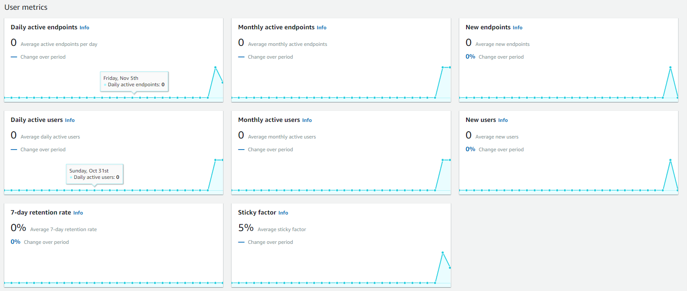
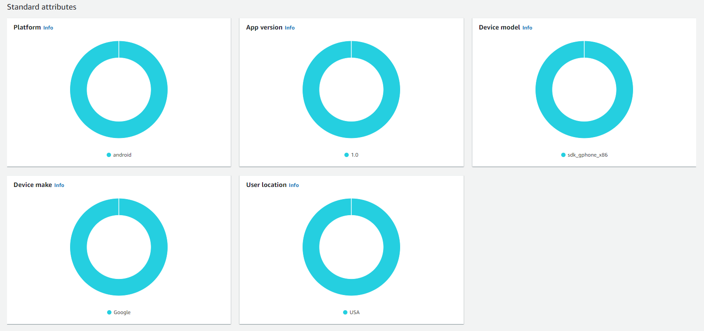
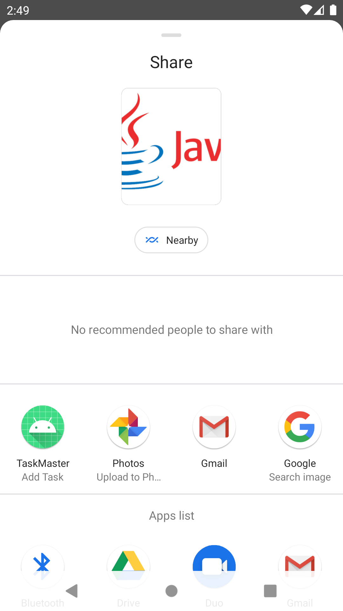

# TaskMaster

## About

TaskMaster is a taskOG management android application with the full functionalities that help you
focus and be more productive through out the day

## Google Play Deployment Checklists
]
[Google Play Application](https://play.google.com/store/apps/details?id=com.osaid.taskmaster)

[x] Create a new developer account and pay the 25$

[x] Setup the merchent account

[x] export the application with a signed key

[x] add the application and assign a release type to it

[x] review your details and hit publish

[x] wait for the application to be reviewed and accepted.

[x] Enjoy the application

## Change Log

31/10/2021 : Added the three basic Activities (The Main Activity , The Add Task Activity , and The
All Tasks Activity) with the functionality to go back and forth between the activities

1/11/2021 : Added a taskOG details and settings pages to the application, changed the labels for all
activities, and I added some storage functionalities to the application to have temporary
persistance data by using the sharedPreferences.

2/11/2021 : Added the recycle view with all the required dependencies , also added the functionally
to take the user to the taskOG details and render the title correctly.

10/11/2021 : Added Amplify as the backend and used the DynamoDB to store and fetch data.

10/11/2021 : Built an APK bundle and included it in the root

14/11/2021 : added the authentication using AWS Cognito

15/11/2021 : added the AWS S3 storage to my application in order to store data

16/11/2021 : added the AWS push notification to the application

17/11/2021 : added AWS pinpoint analytics and event recorders to the application

21/11/2021 : added the intent filter to allow users to share a photo to the application and add it to the task

22/11/2021 : added the task location in the task details

## Screenshots

### lab26

### lab27

### lab28

### lab29

### lab31

Testing is so fast I can not take screenshots of the final result.

### lab32

### lab33

### lab35

### lab36

### lab39

### lab40

### lab41

## License

This application is released under MIT license.
